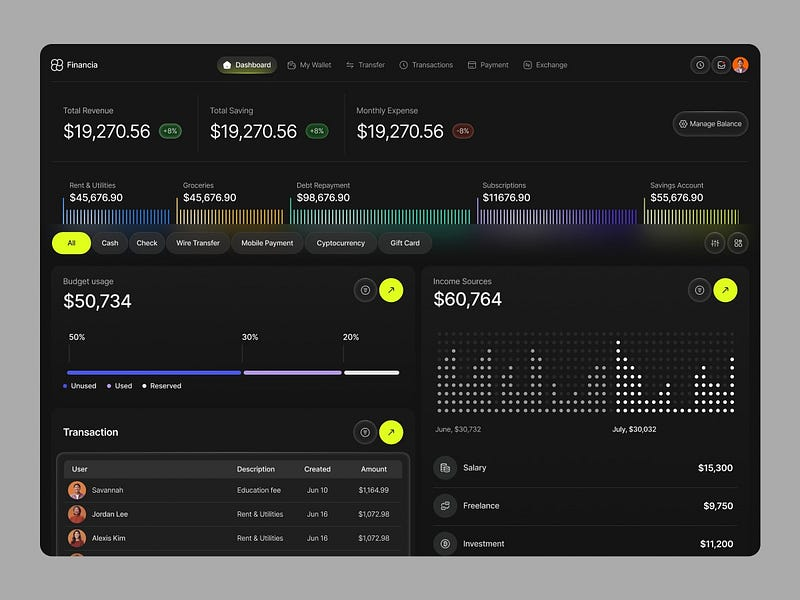

# readme fantasticFour

- este projeto é a estrutura basica de 4 services nodejs python php e bash
- para estudar como essas linguagens agem juntamente e fazer a segurança 

#### estrutura inicial
```bash
fantasticFour/
├── docker-compose.yml
├── nodejs18/        # Configuração do Container Node
│   └── Dockerfile
├── php82/           # Configuração do Container PHP
│   └── Dockerfile
├── python3/         # Configuração do Container Python
│   └── Dockerfile
├── scripts/         # Seus scripts .sh de automação/defesa
└── apps/            # Onde a mágica acontece
    ├── web-node/    # Projeto React/Next.js ou Node puro
    ├── api-php/     # Projeto Laravel/CodeIgniter ou PHP puro
    └── bot-python/  # Seus scripts de IA ou Automação
```


